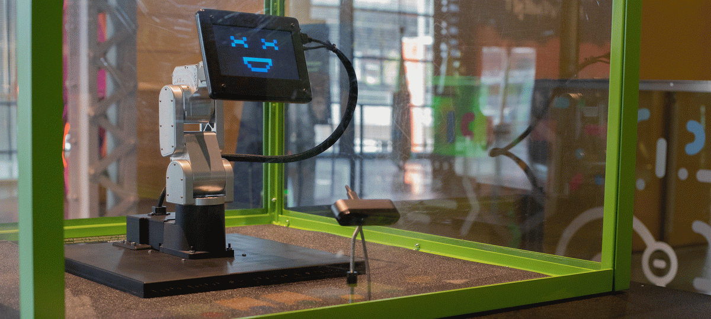
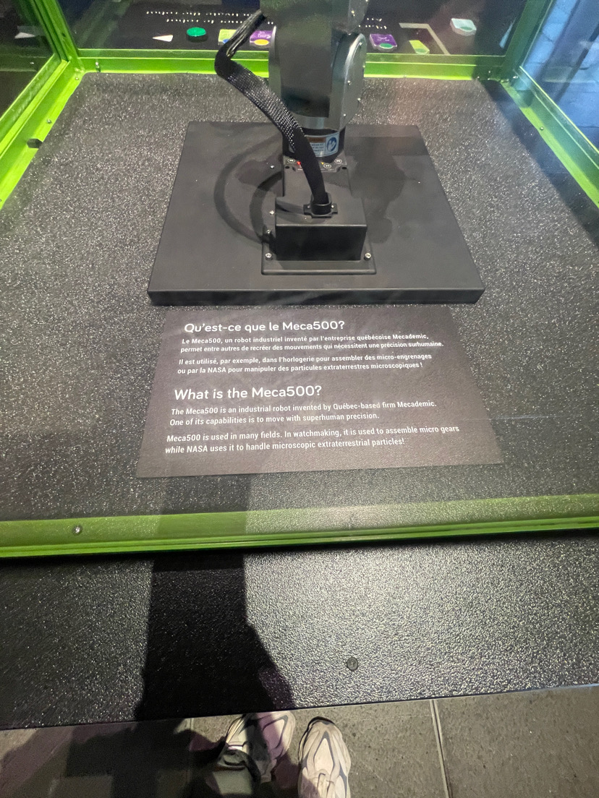
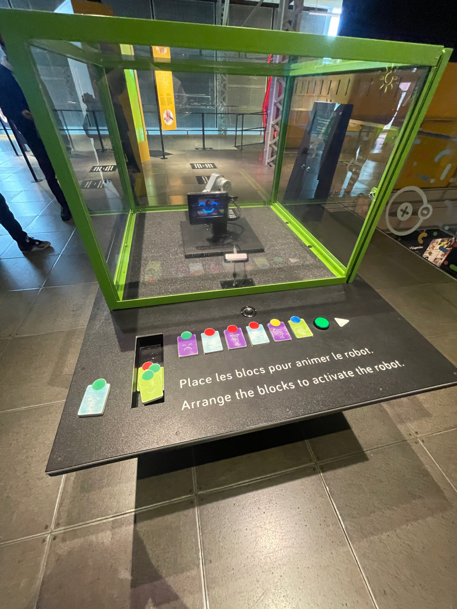
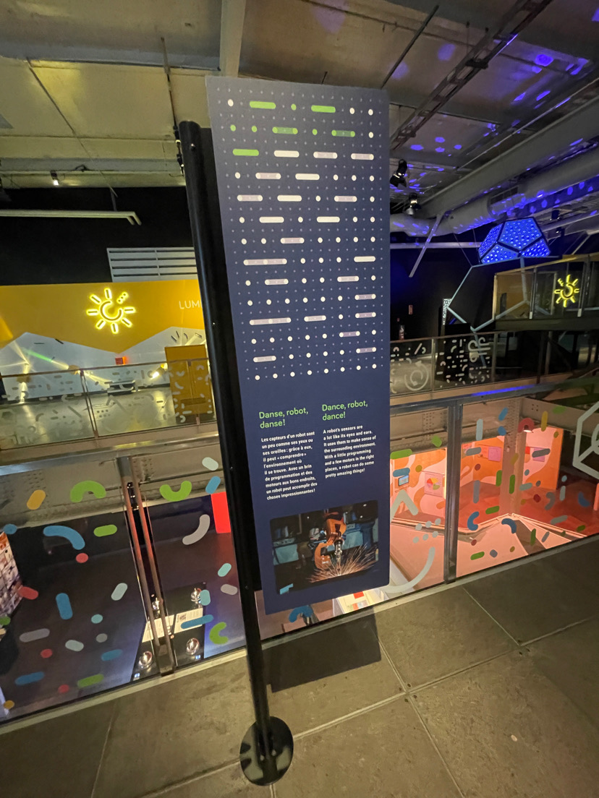

# <ins>Humain</ins>

## Centre des Sciences de Montréal
 

*Image prise devant l'entrée du centre des sciences de Montréal*

Exposition intérieure et permanente visitée le 30 Janvier 2025.

# <ins>Meca500</ins>

*<ins>Meca500</ins>, exposition <ins>Humain</ins>, Centre des Sciences de Montréal*

Dispositif conçu, fabriqué et assemblé par Mecademic en 2021.

*Description du dispositif*

Le dispositif présente un robot qui a des capacités de recréer des mouvement irréalisables par l'humain, à l'aide de technologies, comme par exemple insérer des pièces, danser, souder et bien plus.

Le dispositif est présent au deuxième étage du Centre des Sciences, dans la section Humains du Centre. Cette exposition est permanente et intérieure.

Ce dispositif est interactif.

## Matériel, composition & capacités du dispositif
Le dispositif a de nombreux attraits comme:
- Il est très léger (4,5 kg)
- Compact (Il peut être inséré complètement dans une seule mallette)
- Bien articulé, il a des réducteurs de vitesse qui permet de différencier la vitesse du moteur et la vitesse de ses articulations environ 100 fois moins vite

*Photo grand angle du dispositif*

Le dispositif n'a qu'un gros défaut majeur, il est limité sur le poids qu'il peut déplacer, environ 500 grammes, les créateurs expliquent même que c'est d'où son nom de Meca500 vient.

*Pancarte descriptive du produit*

## Appréciation du dispositif

Le dispositif m'a semblé au premier regard plutôt compliqué, il y avait beaucoup de gadgets qui m'ont pris un peu de temps à comprendre, mais une fois compris, il était vraiment intéressant et captivant.

Ce qui m'a plu, c'est que le dispositif est vraiment équipé il peut tout faire. Avec des boutons et commandes, on peut le faire danser et faire des mouvements atypiques, mais ce qui est encore plus complet, c'est qu'en dehors de l'exposition au Centre des Sciences, il peut réaliser des travaux manuels et remplacer l'homme dans plusieurs domaines. Il peut notamment faire de la soudure, assembler et insérer toutes sortes de pièces.

Ce qui m'a déplu du dispositif, c'est l'accessibilité de ce dernier. Certes je comprends que puisqu'il est situé dans un musée et qu'il peut y avoir toutes sortes de visiteurs comme des enfants plus jeunes et plus brusque, ou encore des gens mals intentionnés, mais j'aurais quand même voulu toucher et voir plus en profondeur le fonctionnement et le mécanisme du Meca500. Comme il était dans une grosse boîte de plastique, nous pouvions seulement l'observer et moins le voir et le tocuher, l'examiner plus en profondeur. Ce que je proposerais, c'est d'avoir accès à un de ses robots dans une autre exposition seulement disponible pour des gens avertis et/ou passionnés, ce qui pourrait permettre aux gens comme moi de mieux découvrir plus le Meca500.

[Site du Centre des Sciences de Montréal](https://www.googleadservices.com/pagead/aclk?sa=L&ai=DChcSEwjh9Obn97KLAxUeYEcBHWRxJY8YABAAGgJxdQ&ae=2&co=1&gclid=Cj0KCQiA-5a9BhCBARIsACwMkJ5rxFipudPAHi6vbXw86fXZqV2oRTKTk2Y35XHmwokjbj_MCgWfaZoaAh9nEALw_wcB&ohost=www.google.com&cid=CAESVeD2tSrNBVqXaHkhqeAYf17MEwNoTn43T5s2TFoSW-VXp7-nQVjNwLz71bnglRcXEyN6UiLCSbWEjsnFnQuhRMdi3fXitaW4F-dUEspeqB6gXsjACDM&sig=AOD64_2Azj-R_gqfCaLjsnC907iS5beE3A&q&adurl&ved=2ahUKEwinr-Dn97KLAxXHEFkFHbmyIYkQ0Qx6BAgWEAQ)
